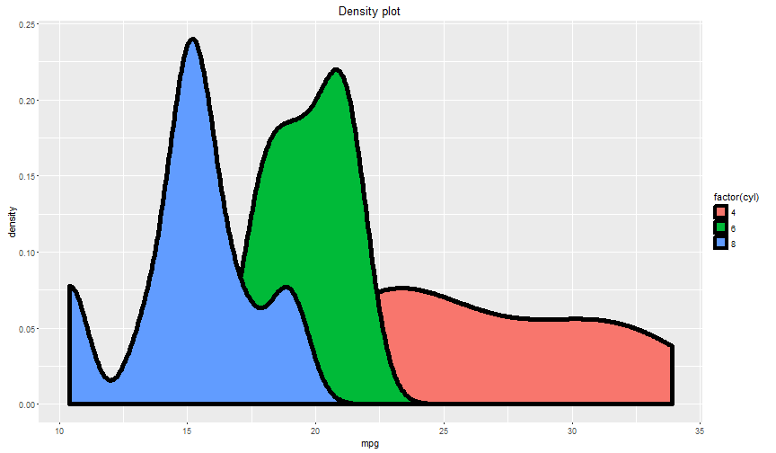

E-mailing R Markdown Reports
========================================================
author: John Marriott
date: 9 February 2017
autosize: true


R Markdown
========================================================


Previously at St. Louis R Users Group:
- [Reproducible data analysis using R Markdown: An Introduction](https://www.meetup.com/Saint-Louis-RUG/events/228804549/)
- [RMarkdown/Shiny for Interactive Bioinformatics](https://www.meetup.com/Saint-Louis-RUG/events/221039734/)

Today:
- Brief overview of R Markdown
- Structure of R Markdown output
- E-mailing R Markdown reports
- Bonus features

Get this at: https://github.com/johnmarriott/EmailRMarkdown 

Basics
========================================================

Interweave text and R code.  This presentation is written in R Markdown.

    # This is R Markdown
    
    Combine text and R code in at least ‘r 1+2‘ ways.
    
    ‘‘‘{r}
    summary(cars)
    ‘‘‘

----

# This is R Markdown
    
Combine text and R code in at least 3 ways.
    

```r
summary(cars)
```

```
     speed           dist       
 Min.   : 4.0   Min.   :  2.00  
 1st Qu.:12.0   1st Qu.: 26.00  
 Median :15.0   Median : 36.00  
 Mean   :15.4   Mean   : 42.98  
 3rd Qu.:19.0   3rd Qu.: 56.00  
 Max.   :25.0   Max.   :120.00  
```

Plotting
========================================================

    ‘‘‘{r, echo=FALSE, fig.width=12}
    ggplot(mtcars, aes(mpg)) + geom_density(aes(fill = factor(cyl)), size=2) + labs(title="Density plot")
    ‘‘‘

----



Tables
========================================================

    ## Prepare data

    ‘‘‘{r, include=FALSE}
    t <- mtcars %>% 
          group_by(cyl) %>% 
          summarise(mean_mpg = mean(mpg))
    ‘‘‘

    ## Use it later

    ‘‘‘{r, echo=FALSE}
    kable(t)
    ‘‘‘
    
----

## Prepare data


## Use it later


| cyl| mean_mpg|
|---:|--------:|
|   4| 26.66364|
|   6| 19.74286|
|   8| 15.10000|

Formats
========================================================

    Export in various formats:
    - HTML
    - PDF
    - Word
    
    We're *focusing* on **HTML** today
    
----

Export in various formats:
- HTML
- PDF
- Word

We're *focusing* on **HTML** today

========================================================

## Resources

- [R Studio has native support for R Markdown](http://rmarkdown.rstudio.com/)
  - [R Markdown integration in the RStudio IDE](http://rmarkdown.rstudio.com/articles_integration.html)
  - [R Notebooks](http://rmarkdown.rstudio.com/r_notebooks.html)
- [knitr package](https://yihui.name/knitr/)
- [Kaggle Kernels](https://www.kaggle.com/kernels) hosts R Markdown reports (with source!)
- Comparable technologies: [IPython/Jupyter](https://ipython.org/), [Apache Zeppelin](https://zeppelin.apache.org/), [Sage Math](https://cloud.sagemath.com), ...


Some applications
========================================================
- Narrate/document exploratory data analysis
- Share methods with results (reproducible research)
- Annotate what a program is doing (literate programming)
- **Self-generating reports** 
  - Event-driven
  - Daily status 
  - Monthly report


Structure: self-contained output
========================================================

All resources embedded into a single file (default).

    > cat report.html

    <!DOCTYPE html>
    <html xmlns="http://www.w3.org/1999/xhtml">
    <head>
    <meta charset="utf-8">
    ...
    
    <script src="data:application/x-javascript,%2F%2A%21%20jQuery%20v1%2E11%2E0%20%7C%20%28c%29%202005%2C%202014%20
    %2E%20%7C%20jquery%2Eorg%2Flicense%20%2A%2F%0A%21function%28a%2Cb%29%7B%22object%22%3D
    typeof%26%26%22object%22%3D%3Dtypeof%20module%2Eexports%3Fmodule%2Eexports%3Da%2Edocument
    ...
    <p>
    <h2>Introduction</h2>
    <p>Lorem ipsum dolor sit amet, consectetur adipiscing elit.</p>


Structure: separate file output
========================================================

Turn off self-contained to generate images (and other supporting files) as separate files.

Markdown header:

    ---
    title: "Report"
    output:
      html_document:
        self_contained: false
    ---
   
Output files:
        
    $ ls -lR
    .:
    total 16
    -rw-r--r-- 1 user 2952790529  853 Jan 19 20:28 report.Rmd
    -rw-r--r-- 1 user 2952790529 4102 Jan 19 20:28 report.html
    drwxr-xr-x 1 user 2952790529    0 Jan 19 20:28 report_files/
    
    ./report_files:
    total 4
    drwxr-xr-x 1 user 2952790529 0 Jan 19 20:28 bootstrap-3.3.5/
    drwxr-xr-x 1 user 2952790529 0 Jan 19 20:28 figure-html/
    drwxr-xr-x 1 user 2952790529 0 Jan 19 20:28 highlight/
    drwxr-xr-x 1 user 2952790529 0 Jan 19 20:28 jquery-1.11.3/
    drwxr-xr-x 1 user 2952790529 0 Jan 19 20:28 navigation-1.1/
    
    ...


E-mailing self-contained file
========================================================

## Assemble e-mail
- Set contents of generated file as body
- Set generated file as attachment

## Outcome
- Images probably won't show up in e-mail client: [Campaign Monitor, Embedded image support in HTML email](https://www.campaignmonitor.com/blog/email-marketing/2013/02/embedded-images-in-html-email/)
- CSS and Javascript aren't applied in e-mail client
- Attached version has both since it opens in browser
- E-mail body is large

## Use this for
- **The attached copy (always)**
- E-mail body if users' clients support it (unlikely)


E-mailing separate files: web hosted images
========================================================

## Assemble e-mail
- Text replacements in HTML: prefix `src` attribute of `img` tags with domain and path (can use `fig.path` argument for easy replacements)
- Set modified HTML as e-mail body

## Server backend
- URI path may have GUID or may overwrite with most recent
- If GUID, consider retention threshold

## Outcome
- Works in most clients, may have to opt-in for sender or domain
- Images only load if user is online
- E-mail body is small

E-mailing separate files: inline attachment images
========================================================

## Assemble e-mail
- Text replacements in HTML: convert `src` to `"cid:filename.png"`
- Set modified HTML as e-mail body
- Set images as attachments with Inline Content Disposition: [one example]( http://stackoverflow.com/questions/18358534/send-inline-image-in-email)

## Outcome
- Displays in some e-mail clients: [Campaign Monitor, Embedding images revisited](https://www.campaignmonitor.com/blog/how-to/2008/08/embedding-images-revisited/)
- Images display offline
- E-mail body is large


Comparison 
========================================================

Another recap of these three options: [SendGrid, How to Embed Images in Your Emails: The Facts](https://sendgrid.com/blog/embedding-images-emails-facts/)

No perfect solution.
- Do you have a web server to host the images?
- How capable are users (can they open attachments)?
- How much time do your users spend on airplanes? 

Overall this factor is less important than the actual content.

Suggested layout 
========================================================

- Initialization
  - Don't echo
  - Load/regenerate an RDS if warranged (front-load all real work)
- Lede: half-screen at most (may be all that's seen)
- Remaining content
- Explanation and contact information (can be forwarded)

Automation 
========================================================

Use `cron`, Windows Task Scheduler, etc., to schedule jobs


Call job with command line:
- Run job [SO](http://stackoverflow.com/questions/27246746/how-to-replicate-knit-html-in-a-command-line): `Rscript -e "rmarkdown::render('report.Rmd')"` 
- Add arguments [SO](http://stackoverflow.com/questions/21512918/how-to-use-knitr-from-command-line-with-rscript-and-command-line-argument): `Rscript -e "rmarkdown::render('report.Rmd')" --args foo=bar` 
- Do more setup: `Rscript -e "source('prepare.R'); rmarkdown::render('report.Rmd')"` 

May want to configure:
- Working directory
- Output directory
- Password file to use
- Report parameters (same report for different divisions)


Bonus features
========================================================

- Use CSS or insert HTML (logo) for a custom look and feel/branding (relatively easy)
- Attach a data extract of source data of the report (easy for CSV, medium for Excel)
- Build a settings and subscription system (hard)
- Include plain text and HTML e-mail bodies: [Litmus, Best Practices for Plain Text Emails + A Look at Why They’re Important ](https://litmus.com/blog/best-practices-for-plain-text-emails-a-look-at-why-theyre-important)
